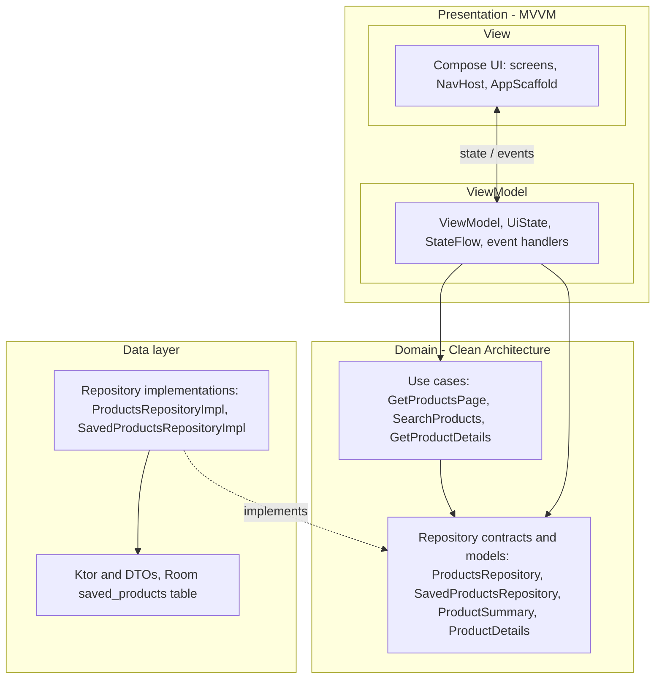

# Next Android Technical Challenge (DummyJSON)

This repository is a Jetpack Compose Android app that consumes DummyJSON’s Products API and implements a subset of the challenge user stories and bug fixes.

## Tech stack
- **UI**: Jetpack Compose (Material 3)
- **Architecture**: Clean-ish **MVVM + UDF** (single `UiState` per screen)
- **DI**: **Koin**
- **Networking**: **Ktor** + `kotlinx.serialization`
- **Local storage**: **Room** (saved product summaries + timestamps), **KSP** for the Room compiler
- **Image loading**: **Coil (compose)**
- **Navigation**: `navigation-compose`
- **Connectivity**: `ConnectivityManager` default network callback (`NetworkMonitor`) for app-wide offline UI
- **Testing**: JUnit + `kotlinx-coroutines-test`; `androidTest` with custom `Application` / runner and Koin test doubles

## Architecture overview (high level)
- **`core/`**: DI modules, navigation, theme, **network connectivity** (`NetworkMonitor`)
- **`core/ui/shell/`**: app chrome (top app bar + bottom navigation) + shell state
- **`data/`**: DTOs + API client + repository implementations (**products** remote + **saved** Room)
- **`domain/`**: models + repository interface + use cases
- **`presentation/`**: Compose screens + ViewModels + `UiState`

**MVVM (presentation):** Composable **Views** observe **ViewModels**; each screen exposes a single **`UiState`** (`StateFlow`) and handles user actions as one-way events (unidirectional data flow).

**Clean Architecture:** **Domain** defines **use cases** and **repository contracts** (plus entities); **Data** implements those contracts and talks to Ktor/Room. Presentation depends on Domain only, not on Ktor or Room types.

## Architecture diagram

The diagram below shows **MVVM** inside the presentation layer and how it sits on top of **Domain** and **Data** (Clean Architecture). Solid arrows are compile-time dependencies; dashed arrows mean *implements* (repository implementations satisfying domain interfaces).



**Runtime wiring (not separate layers):** `MainActivity` → `AppScaffold` (`NetworkMonitor`, chrome) → `TechTestNavHost` → screens above. Remote calls go **ProductsRepository** → **DummyJsonApiClient** → DummyJSON; saved products go **SavedProductsRepository** → Room.

## Implemented features

### User Stories
Completed: **User Stories 1, 2, 3, 4, and 5**.

- **User Story 1 (Priority 1) – List Tile UI**
  - Product tile shows **thumbnail**, **title (max 2 lines)**, **brand**, and **price**.
  - Discount badge: red **SALE** only when **discount ≥ 50%**; otherwise (0–50%) an **orange** chip shows **percentage OFF** (e.g. `12% OFF`); no chip at 0%. Strikethrough original price still applies whenever discount is greater than 0.
  - PLP and **Search** lists **prioritise** major-sale items (≥ 50%) at the top among **loaded** pages (stable partition after each API merge; pagination `skip` unchanged).
  - **Saved / heart** on each tile: persists **locally** (Room); the same saved state is shared with **Search**, **PDP**, and the **Saved** tab (toggle anywhere updates the others when you return or recompose).
  - **Golden star rating** on the tile.
  - Image fallback uses a simple placeholder when thumbnail is missing.

- **User Story 2 (Priority 3) – Product List Grid Layout**
  - PLP is a **responsive grid** using `LazyVerticalGrid` with a calculated **fixed column count** to guarantee **at least 2 columns** on phones and scale up on larger screens.
  - Uses stable item keys for smooth scrolling.
  - **Infinite scroll pagination** using DummyJSON `limit` + `skip` (page size 30).

- **User Story 3 (Priority 4) – Enhanced product search — completed**
  - **Search** tab: query field with **debounced** requests (~350 ms) and **IME search**; clear control.
  - Calls DummyJSON **`GET /products/search?q=...`** with the same **`limit` / `skip`** pagination and PLP field `select` as the product list endpoint.
  - Results reuse the **same grid + tile** behaviour as the PLP; opening a tile navigates to the same PDP route as Home.
  - **No results** copy includes the active query (some terms, e.g. “jeans”, may return zero hits on DummyJSON’s sample data—try **phone**, **shirt**, **dress**).
  - **Errors** (while online): message + **Retry** for the last query.
  - **App-wide offline**: when there is no validated default network, **`AppScaffold`** shows a **full-screen** “No internet connection” state (no chrome, no navigation) with **Retry**; restores the previous back stack when connectivity returns.

- **User Story 4 (Priority 2) – Product Details Page (PDP)**
  - Navigates from PLP → PDP.
  - PDP displays: title, SKU (`id`), **image carousel** with dot indicator, price (sale/original), rating, brand/category, description, warranty/return/shipping info, and a sticky **Add to Cart** CTA.
  - **Save (heart)** in the top bar uses the same **local saved list** as the PLP/Search tiles (filled vs outline icon).
  - PDP supports **pinch-to-zoom + pan** on images while preserving **pager swiping** when not zoomed.
  - PDP shows **reviews** (name → stars → quoted comment → date formatted as `DD - Month - YYYY`), and tapping the rating near the price scrolls to the reviews section.

- **User Story 5 (Priority 3) – PLP ↔ PDP transitions + predictive back — completed**
  - PDP is presented as a **full-screen dialog overlay** so the PLP remains visible underneath.
  - **Entry**: PDP content **slides up from bottom** while the underlying PLP performs a gentle **fade-away** effect (via a transition-driven scrim).
  - **Exit**: exact reverse — PDP **slides down off-screen** while PLP **fades back in**.
  - **Predictive back**: exit transition is **scrubbable** using `PredictiveBackHandler` (PDP position + scrim respond to gesture progress).
  - **Swipe-down-to-dismiss**: scrubbable dismissal gesture on PDP when content is scrolled to the top (avoids conflicts with normal scrolling).

### App chrome (home)
- App chrome is hosted in a dedicated **AppShell** (`AppScaffold`), not in feature screens.
- Top app bar (title + cart icon) and bottom navigation (Home/Search/Saved/Bag/Account) are shown for top-level destinations.
- Chrome is **hidden on PDP** (`product/{id}`) to keep the product details experience full-screen.
- **Search** is a real **product search** screen. **Saved** shows **locally stored** favourites in the same grid/tile layout as the PLP; **empty state** when nothing is saved. **Bag** and **Account** remain **placeholder** tabs.

### Bug fixes (from the challenge PDF)
- **Bug 1 (Priority 1) – Crash on app load**
  - Replaced strict product model with endpoint-aligned **DTOs** (nullable fields) and mapping to domain models.
  - Added error handling so failures show an error state rather than crashing.

- **Bug 2 (Priority 2) – UI below system bars**
  - Fixed insets/padding usage with `Scaffold` and safe drawing insets.

- **Bug 3 (Priority 3) – Text is magenta**
  - Removed forced magenta `onSurface` override from the theme.

- **Bug 4 (Priority 2) – Requests taking too long**
  - Removed artificial delay from the API client and added loading UI states.

## Tests
- **Unit (JVM)**: ViewModels (products, product details, **search**, shell where applicable), use cases, repository implementation (including **`/products/search`** MockEngine cases); **`FakeNetworkMonitor`** for connectivity-related logic without Robolectric; **`FakeSavedProductsRepository`** for saved-state wiring in ViewModel tests.
- **androidTest**: `TestRunner` installs `TestTechTestApp` with a fake `ProductsRepository`, **`FakeSavedProductsRepository`**, **`NetworkMonitor` always online** by default, and regression checks (e.g. semantics / contrast on `app_root`).

Run JVM tests:

```bash
./gradlew testDebugUnitTest
```

Instrumentation (device or emulator):

```bash
./gradlew :app:connectedDebugAndroidTest
```

## How to run
Open the project in Android Studio and run the `app` configuration, or from CLI:

```bash
./gradlew :app:installDebug
```

## Pending user stories / enhancements
- **App shell polish**
  - Keep bottom-nav selection in sync with the current route (e.g., deep links or back navigation across tabs).
  - Add separate navigation graphs per tab if/when those features become real.

- **UI polish**
  - Replace **Bag** and **Account** placeholder tab content with real features.
  - Consider Window Size Classes for explicit compact/medium/expanded layouts.

## Notes / assumptions
- Currency formatting is currently **Locale.UK** to ensure a currency symbol is shown.
- “SKU” is represented by the DummyJSON `id` field (no separate SKU field in the API payload used).

## AI collaboration prompts

Reusable lead-engineer style prompt blocks (architecture, shell, motion, search, offline, tests, etc.) live in **[`docs/ai-collaboration-prompts.md`](docs/ai-collaboration-prompts.md)** for adapting to other projects.

